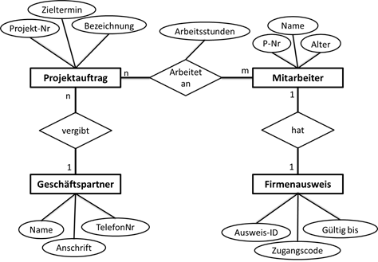
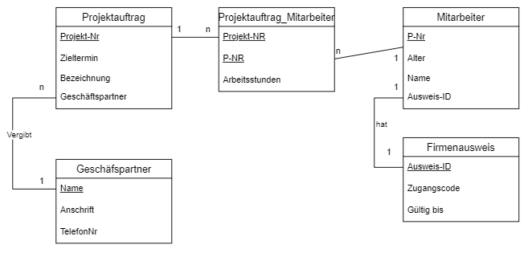

[Zurück](/)\
[Dateien](/files/#awp)\
[Klassennotizbuch](https://cryptpad.fr/pad/#/2/pad/edit/a5yHproaBJN8nlJdmNrtfmSL/)\
(Wird aber auch rein kopiert)

- [1. Grundlagen](#1-grundlagen)
  - [LS 1.1 Daten und Datenquellen](#ls-11-daten-und-datenquellen)
  - [LS 1.2 Datenbank Grundlagen](#ls-12-datenbank-grundlagen)
- [2. Datenmodellierung](#2-datenmodellierung)
  - [2.1 Phasen der Datenmodelierung](#21-phasen-der-datenmodelierung)
    - [Handlungsschritte](#handlungsschritte)
    - [1. Informieren Sie sich über die einzelnen Phasen der Datenbankentwicklung mit Hilfe des Infotextes](#1-informieren-sie-sich-über-die-einzelnen-phasen-der-datenbankentwicklung-mit-hilfe-des-infotextes)
    - [2. Schreiben Sie Tätigkeiten und Ziele der einzelnen Phasen in der Übersicht zusammen](#2-schreiben-sie-tätigkeiten-und-ziele-der-einzelnen-phasen-in-der-übersicht-zusammen)
    - [3. Präsentieren Sie Ihre Ergebnisse](#3-präsentieren-sie-ihre-ergebnisse)
  - [2.2.1 ER-Diagramm](#221-er-diagramm)
  - [SQL Übungen](#sql-übungen)

## 1. Grundlagen

### LS 1.1 Daten und Datenquellen

[mebis](https://lernplattform.mebis.bayern.de/course/view.php?id=1162649&section=14#tabs-tree-start)

Arbeitsauftrag: Welche Daten fallen an?

- Metadaten
  - IP Adresse
  - Präferenzen der User
  - Verlauf des Users (Wo hat man zuvor hingeklickt?)   - SchufaPrüfung
  - Browser
  - Betriebssystem
- Bewegungsdaten (ProzessdateLSn)
  - Abschluss einer zusätzlichen Garantie (JA/NEIN)
  - tatsächlichen Bankdaten / Bezahlart
  - Gesamtpreis
  - Rechnungsnummer
  - Zahlungsart
  - Zahlungstermin
  - Liefertermin
  - tatsächliche Lieferadresse
- Stammdaten
  - Kunden-Name, Anschrift (Straße, Wohnort, PLZ)
  - gespeicherten Bankdaten
  - Privat- oder Firmenkunde
  - Preis pro Stück
  - Artikelnummer
  - Alter

Verschiedene Datenmodelle erklärt:\
[XML, JSON und CSV](https://lernplattform.mebis.bayern.de/mod/book/view.php?id=35143828)

### LS 1.2 Datenbank Grundlagen

[mebis](https://lernplattform.mebis.bayern.de/course/view.php?id=1162649&section=15#tabs-tree-start)

Einstieg Lernsituation: Warum nutzen wir Datenbanken?

- Einfacher die Korrektheit der Daten zu gewährleisten (Datenprüfung, automatische Nummerierung,...)
- Bessere Dateneingabe
- Einheitliche Daten
- Mehrere Personen können parallel auf die Datenbank zugreifen
- Unabhängig vom Anwendersystem oder Geräten
- Bessere Strukturierung der Daten
- Effizientere Abfragen von Daten
- Zentrale Datenspeicherung
- Vermeidung von Redundanzen

[Zusammenfassung](./Datenbanken_zusammenfassung.md)

## 2. Datenmodellierung

### 2.1 Phasen der Datenmodelierung

[mebis](https://lernplattform.mebis.bayern.de/course/view.php?id=1162649&section=16#tabs-tree-start)

- ER-Modell erstellen
- Ist/soll Zustand bestimmen
- Größe der Datenbank bestimmen
- Skalierbarkeit der Datenbank definieren
- GUI planen
- Zugriffsverwaltung/Rechtekonzept

#### Handlungsschritte

#### 1. Informieren Sie sich über die einzelnen Phasen der Datenbankentwicklung mit Hilfe des [Infotextes](./resources/Datenbanken/020_INF_PhasenDatenbankenwicklung_01b.pdf)

#### 2. Schreiben Sie Tätigkeiten und Ziele der einzelnen Phasen in der Übersicht zusammen

  Phasen anhand [dieses Modelles](./resources/Datenbanken/030_AB_PhasenDatenbankenwicklung.pdf)

1. Anforderungsanalyse
   - **Tätigkeiten**
     - Datenformat definieren
     - Ziel der Datenbank bestimmen
     - Anforderungen der Benutzer definieren und Klassifizieren
     - Datenbasis bestimmen
   - **Dokumente**
     - Lastenheft/Pflichtenheft
2. Konzeptioneller Entwurf
   - **Tätigkeiten**
     - Definition der Datenobjekte mit deren Attributen
     - Bestimmung der Beziehungen (zwischen den Daten)
     - Festlegung des Datanbankmodells
     - Erstellung des ER-Modells
   - **Dokumente**
     - Konzepttionelles Gesamtschema
     - ER-Modell
3. Logischer Entwurf
   - **Tätigkeiten**
     - Überprüfung des ER-Modells anhand von Transformationsregeln in ein Logisches Modell
     - Überprüfung mit Hilfe der Normalisierung
   - **Dokumente**
     - Logisches Datenbankmodell
     - Relationales Datenbankmodell
4. Physische Phase
   - **Tätigkeiten**
     - Definition der Speicherstrukturen/Zugriffsmechanismen
     - Implementierung des internen und externen Schemas
     - Zugriffsrechte Festlegen
   - **Dokumente**
     - Datenbank
     - SQL-Skript

[Arbeitsblatt Anforderungsanalyse](./resources/Datenbanken/040_AB_Anforderungsdefinition_SuS.pdf)

**Tätigkeit: Informationsstruktur ermitteln**\
  In der erstenPhase der Datenmodell-Entwicklung wird die Informationsstruktur des Datenmodells definiert[Top-down-Ansatz (globales Datenmodell) bzw. Bottom-up-Ansatz (anwendungsorientiertes Datenmodell)]\
  Nennen Sie Möglichkeiten die Informationsstrukturdes Autohauses Nettmannszu ermitteln:

- Bottom-Up-Ansatz:
  - Analyse einzelner Dokumente (Rechnungen, Aufträge etc.)
  - Analyse über bestehende Datenbasis (Excellisten, CSVs etc.)
- Top-Down-Ansatz:
  - In Besprechungen/durch Realitätsbeaobachtungen werden Datenobjekte/Beziehungen definiert

#### 3. Präsentieren Sie Ihre Ergebnisse

   [Präsentation](n.a.)

### 2.2.1 ER-Diagramm

[mebis](https://lernplattform.mebis.bayern.de/course/view.php?id=1162649&section=17)



Entität: Objekt (in einem Rechteck)\
Relation: Beziehung (in einer Raute)\
Attribute: Eigenscahften (in einer Elipse/Kreis)

### SQL Übungen

```sql
SELECT Name, Art FROM Haustiere WHERE  ORDER BY Name ASC;
SELECT * FROM Patienten WHERE Ort='Fürth' ORDER BY Nachname ASC, Vorname ASC;
SELECT * FROM Patienten WHERE Ort LIKE 'F%' ORDER BY Nachname ASC, Vorname ASC;
SELECT 5+5*12, 'Alter'*2 AS Doppeltes_Alter FROM Patienten LIMIT 5;
```

Dokumentation:

```sql
source c:\xampp\sql_scripts\sql_dump.sql
(use rfidv5klein)
SELECT * FROM tblzutrittsversuche;
1. SELECT ZutrittsversuchID FROM tblzutrittsversuche;
2. SELECT ZutrittsversuchID FROM tblzutrittsversuche WHERE Ergebnis="Zutritt abgelehnt";
3. SELECT ZutrittsversuchID FROM tblzutrittsversuche WHERE Ergebnis="Zutritt gestattet" ORDER BY tblChips_ChipsID;
4. SELECT Zeitstempel, tblChips_ChipsID FROM tblzutrittsversuche WHERE Ergebnis="Zutritt abgelehnt" ORDER BY Zeitstempel DESC;
5. SELECT tblChips_ChipsID FROM tblzutrittsversuche WHERE Ergebnis="Zutritt abgelehnt" GROUP BY tblChips_ChipsID;
6. SELECT tblChips_ChipsID FROM tblzutrittsversuche WHERE Ergebnis="Zutritt gestattet" GROUP BY tblChips_ChipsID ORDER BY tblChips_ChipsID;
7. SELECT Count(*) AS AnzahlZutritte FROM tblzutrittsversuche WHERE Zeitstempel LIKE '2017-11-22%' AND Ergebnis='Zutritt gestattet';
8. SELECT * FROM tblzutrittsversuche WHERE Ergebnis='Zutritt abgelehnt' AND tblChips_ChipsID LIKE '1%';
9. SELECT tblChips_ChipsID,Count(*) AS Zutritte FROM tblzutrittsversuche WHERE Ergebnis='Zutritt gestattet' GROUP BY tblChips_ChipsID;
10. SELECT tblChips_ChipsID,Count(*) AS Zutritte FROM tblzutrittsversuche WHERE Ergebnis='Zutritt gestattet' GROUP BY tblChips_ChipsID having Zutritte > 10;
11. SELECT SUM(tblChips_ChipsID) AS SumChips FROM tblzutrittsversuche;
12. SELECT Distinct tblChips_ChipsId FROM tblZutrittsversuche WHERE Ergebnis='Zutritt Abgelehnt' tblChips_ChipsId NOT IN (Select tblChips_ChipsId FROM tblZutrittsversuche WHERE Ergebnis='Zutritt gestattet');
13. SELECT tblChips_ChipsId, Ergebnis FROM tblZutrittsversuche AS AueSelect WHERE Zeitstempel = (SELECT MIN(Zeitstempel) FROM tblZutrittsversuche AS InnSelect WHERE InnSelect.tblChips_ChipsId = AueSelect.tblChips_ChipsId) ORDER BY tblChips_ChipsId;
```



Schüler Fragen: Warum Geht Herbert Oft Laufen = Select From Where Group-By Having Order-By Limit

Übungen:

```sql
1. select count(*) AS Laender from country where continent='Europe';
2. select continent from country group by continent;
3. select count(DISTINCT continent) AS Continents from country;
4. select name, max(surfacearea) from country group by continent;
5. Select Name, surfaceArea from country where continent='europe' order by surfaceArea desc;
6. Select Name, continent, surfaceArea from country order by surfaceArea;
7. select * from country where indepyear <= 0;
8. Select Name, Continent, SurfaceArea from country AS outerC where surfaceArea = (select max(surfaceArea) from country AS innerC where innerC.continent= outerC.continent) group by continent;
9. select * from country where GovernmentForm='Overseas Department of France';
10. select * from country order by lifeexpectancy desc limit 3;
11. select continent, avg(lifeexpectancy) from country group by continent;
12. select continent, count(Name) as Laender from country where lifeExpectancy > 75 group by continent;

21. 
```
