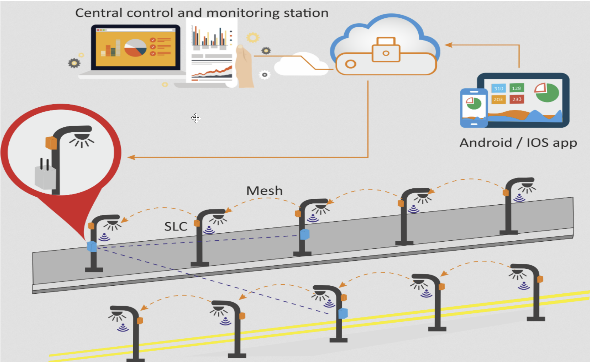
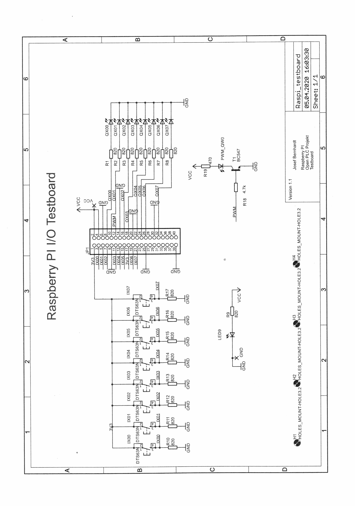

[Zurück](/)\
[Dateien](/files#itt)\
[Mitschrift](https://docs.google.com/document/d/1I6zBz2cM4uV0Hzi5TliMU-tyylGswI217WQqIjOcaFM/edit?usp=sharing)\
(Wird reinkopiert, Bilder eher nicht so)

- [Wie realisieren wir die Torüberwachung des AHN?](#wie-realisieren-wir-die-torüberwachung-des-ahn)
- [Unterschied Lastenheft - Pflichtenheft](#unterschied-lastenheft---pflichtenheft)
- [Kriterien für ein Cyberphysisches System (min. 6 Stück)](#kriterien-für-ein-cyberphysisches-system-min-6-stück)
  - [Beispiel für CP-Teilsysteme (Smart City Light Barcelona)](#beispiel-für-cp-teilsysteme-smart-city-light-barcelona)
- [Begriffserklärung](#begriffserklärung)
  - [Robustheit](#robustheit)
  - [Härtung](#härtung)
- [Besonderheiten/Unterschiede zwischen Linux und Windows](#besonderheitenunterschiede-zwischen-linux-und-windows)
  - [Linuxgrundlagen](#linuxgrundlagen)
- [Laden des Python-Programm “Werkstatttore” auf den Raspberry Pi](#laden-des-python-programm-werkstatttore-auf-den-raspberry-pi)
- [Vertikale Kommunikation](#vertikale-kommunikation)
- [Klassische Automatisierungspyramide](#klassische-automatisierungspyramide)

## Wie realisieren wir die Torüberwachung des AHN?

Sensoren → 4x Türschließ-Sensor→ Öffner\
Alternative zu Raspberry Pi: Rock Pi, ESP32, Arduino, SPS, PLC\
Lokale DB: MariaDB, Xampp, → 5 Datensätze mit TimeStamp\
Cloudbasierte DB: (DBaaS) Cosmos-DB, AWS MongoDB (NoSQL)\
Benutzerfreundliche Darstellung / Abrufbarkeit:\
App, LED, Kontrollleuchte, Dashboard Node Red, …\
Protokolle: TCP/IP, MQTT, OPCUA, ….\

## Unterschied Lastenheft - Pflichtenheft

Lastenheft: Anforderungen des Auftraggebers (Wünsche und Ziele; meist laienenhaft formuliert)\
Pflichtenheft: Umsetzung der Auftragnehmers, die an den Auftraggeber zurückgeschickt wird (technische Umsetzung wird angegeben)

## Kriterien für ein Cyberphysisches System (min. 6 Stück)

- Teilsysteme:  Kombination aus Softwaretechnischen und mechanischen Komponenten
- Autonom: Teilsystem muss auch funktionieren, keine Kommunikation untereinander möglich.  Eingriff über HMI muss möglich sein!
- Abstimmung der vernetzten Komponenten (Datenbanken SAP, Teilsysteme, HMI, Leitstand, ...) Software mit fertigen Schnittstellen,Middleware-Software → OPC Router
- Benötigter Datenaustausch erfolgt untereinander, Teilkomponenten kommunizieren untereinander
- Cybersecurity
- Daten eines cyberphysischen Systems müssen abgespeichert werden
- Informations- und Softwaretechnische Komponenten werden mit mechanischen verbunden. Datentransfer/-austausch findet über ein Netzwerk (z.B. das Internet) in Echtzeit statt
- Graphische Benutzeroberfläche

### Beispiel für CP-Teilsysteme (Smart City Light Barcelona)

Ein sehr gutes Beispiel, dass Teilsysteme untereinander kommunizieren!

## Begriffserklärung

### Robustheit

Funktionalit muss nach Stromausfall / Fehlerhafter Bedienung / Temp.-Schwankungen auch gegeben sein

### Härtung

allgemeine IT-Sicherheit für das System (z. B. Updates müssen regelmäßig gemacht werden)

## Besonderheiten/Unterschiede zwischen Linux und Windows

- Open Source
- Alles ist eine Datei (Befehle, Ordner, etc.)
- Alles kann automatisiert werden (z.B. mit Cron)
- case-sensitive
- Multi-User-Betriebssystem (mehrere Desktops)
- root-User
- Arbeiten in der Shell
- sudo (Befehl, um den darauf folgenden Befehl als Admin auszuführen)
- Hardware wird auch als Dateien abgelegt

### Linuxgrundlagen

Welche grundlegenden Arten von Befehlen sollte man in jedem Betriebssystem kennen?

[Dieses Arbeitsblatt](./resources/120_AB_Unix-Grundbefehle_SuS.pdf)

1. Welche Benutzer sind auf dem System angemeldet?\
   last
2. Mit welcher Kennung sind sie angemeldet?\
  whoami
3. An welchem Verzeichnispfad befinden Sie sich gerade?\
  pwd
4. Lassen Sie sich den Inhalt des aktuellen Verzeichnisses anzeigen!\
  ls
5. Erstellen Sie das Unterverzeichnis cpsim aktuellen Verzeichnis und überprüfen Sie,ob dies erstellt wurde\
  mkdir cps/
6. Welche Unterverzeichnisse gib es in /Documents?\
   cd /documents; ls -> Keine
7. Erstellen Sie im Verzeichnis /Documents/cps eine Datei namens *b3.txt* mit dem Inhalt „Hallo Welt!“\

    | variante 1 | variante 2 |
    | --- | ---|
    | touch b3.txt   vi b3.txt   ESC i   Hallo Welt!   ESC :wq | Cat > b3.txt   Hallo Welt!   Eingabe CTRL+C |

8. Benennen Sie die Datei b3.txtin les.txt um:\
   mv b3.txt les.txt
9. Erstellen Sie eine Kopie der Datei les.txtund benennen Sie diese les-kopie.txt\
    cp les.txt les-lopie.txt
10. Wie müssen Sie den Befehl anpassen, wenn die Kopie les-kopie.txtim übergeordneten Ordner kopiert werden soll?\
  cp lex.txt ../les-kopie.txt
11. Wechseln Sie in den übergeordneten Ordner und benennen Sie die Datei *les-kopie.txt* in *les-kopie2.txt* um! Verschieben Sie die Datei anschließend in den Ordner /Documentsunter ihren User!\
  cd ..; mv les-kopie.txt Documents/les-kopie-verschoben.txt
12. Löschen Sie die Datei les-kopie-verschoben.txt\
  rm les-kopie-verschoben.txt
13. Löschen Sie nun das das Verzeichnis cps\
  cd ..; rm -r cps
14. MarkierenSie sich den Ordner Documents um schneller dorthin springen zu können (Lesezeichnen setzen).\
  pushd Documents; popd
15. Lassen Sie die Benutzerechte der Datei les.txtanzeigen! Welche Rechte sind vergeben?\
  ls -lah (-rw-rw-r-- 664)
16. Ändern Sie die Benutzerrechte des Eigentümers, der Gruppe und aller anderen der Datei les.txtauf nur lesen!\
  chmod 444 les.txt
17. Wie lautet die IPv4-Adresse Ihres Systems? \
  ifconfig
18. Wie lautet die IPv4-Adresse zu dem Hostnamen www.b3-fuerth.de?\
  nslookup www.b3-f.de
19. Öffnen Sie eine Root-Shell\
  sudo -s
  
## Laden des Python-Programm “Werkstatttore” auf den Raspberry Pi

1. Verbindung testen
-->OSI 1 NW-Kabel angeschlossen
-->OSI 2 Link vorhanden -->LED
-->OSI 3 Raspi 192.168.2.59/24 im gleichen Subnetz wie Laptop

2. Datei mit Filezilla oder Swish auf den Rasbperry übertragen
-->Verbindung über SFTP und Benutzer pi (PW schueler) mit Verzeichnis /home/pi
herstellen

3. Abändern des Python Programms direkt auf dem Raspi mit Hilfe von VNC
-->Python Programm öffnen und die GPIOs an das Bernhardt-Board anpassen

## Vertikale Kommunikation

| Bereich | Beschreibung | Beispiel für Geräte |
| - | - | - |
| **Cloud** | - Zugriff meist über Internet und geräte-unabhängig - Bereitstellung erfolgt bei Bedarf, zeitnah und mit wenig Aufwand geteilt *Computerresourcen* als Dienstleistung (Server, Datanspeicher) - Abrechnung nach Nutzung Zugriff auf Angebot und Nutzung erfolgt i.d.R. über eine *Programmierschnittstelle* (API) oder Webseite | AWS NoSQL |
| **Office-IT, Unternehmens-IT** | - Office IT beinhaltet alle Geräte, Komponenten und alles Zubehör, welche für allgemeine Bürotätigkeitn genutzt werden (PC, Maus etc.) - Unternehmens-IT is IT-Infrastruktur, die in alleiniger Verantwortung des Unternehmens liegt. Hierzu zält die Bereitstellung von Geräten und Diensten | Router, Switch, "Desktop"-PCs, OPC UA, Interne DB |
| **Shop-Floor, OT** | - Steuerung und Kontrolle der Produktionsprozesse - Ziel: Optimierung der vorhandenen Produktionsressourcen, auf Basis unterschiedlicher Prämissen wie bspw. Termine, Kapazitätsauslastung oder erzielbarer Produktmarge (Kommt aus ERP)  | HMI, PLC, Pi, Service-PC, OPC UA |

## Klassische Automatisierungspyramide

Feldebene: Horizontale Kommunikation. Sensoren kommunizieren im shop-Floor über ASI, IO-Link, ProfiBus

| Geräte | Steuerung SPS/PLC | SPS | HMI | Servo-Motor |
| - | - | - | - | - |
| **Ebene** | Steuerung | Steuerung | Steuerung | Feld |
| **Geräte** | SAP | Roboterarm | Darstellung eines Prozesses | |
| **Ebene** | Prozessleitung | Feld | Prozessleitung | |
| **Geräte** | HMI + Sensorwerten | Signalleuchte | Lichtschranke | Greifer |
| **Ebene** | Steuerung | Feld | Feld/Steuerung | Feld |
| **Geräte** | Indultiver Sensor | Öffner/Schalter | Leitstand | Profi Bus |
| **Ebene** | Feld | Feld | Betriebsleitung | Feldebene |

---

